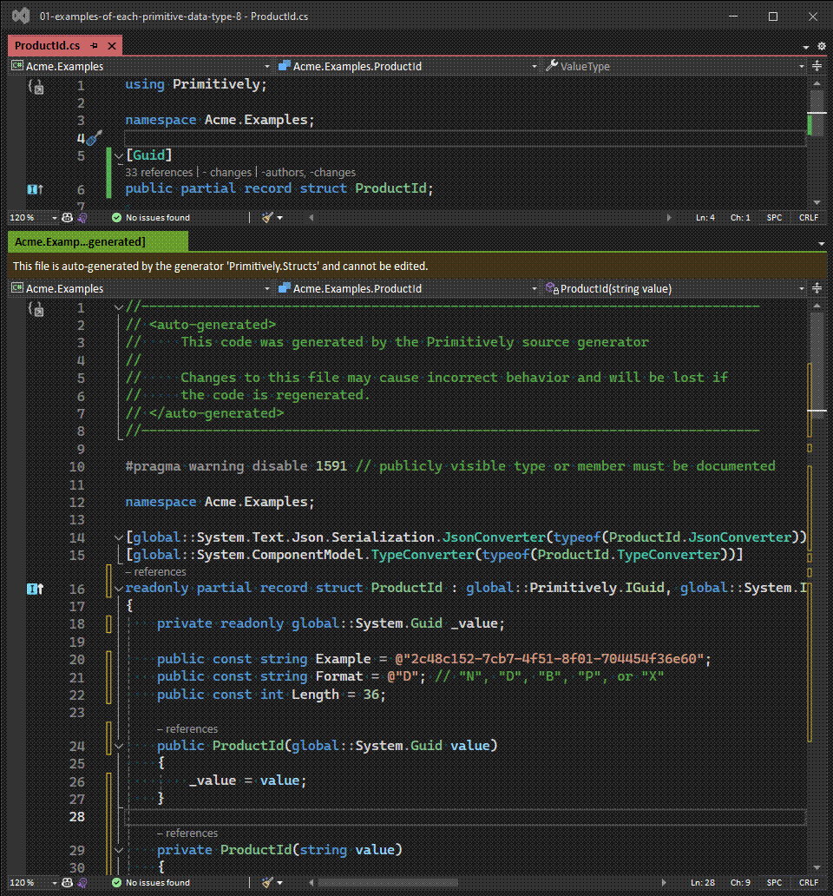

# Primitively  [](https://github.com/dtanglr/Primitively/actions/workflows/dotnet.yml)

**Primitively** is a Rosyln-powered C# source code generator of strongly-typed IDs and DDD-style value objects that encapsulate a single GUID, integer, date or string .NET *primitively* typed value.

For example: - 

```csharp
// Before
public record Product(Guid Id, Guid Sku);

// After
public record Product(ProductId Id, Sku Sku);

[Guid]
public partial record struct ProductId;

[Guid]
public partial record struct Sku;
```

## NuGet Packages

| **Package** | **Latest Version** | **About** |
|:--|:--|:--|
| `Primitively` | [](https://www.nuget.org/packages/Primitively/ "Download Primitively from NuGet.org") | The Primitively source generator package. |
| `Primitively.Abstractions` | [](https://www.nuget.org/packages/Primitively.Abstractions/ "Download Primitively.Abstractions from NuGet.org") | Primitively interfaces, metadata, attributes and configuration classes. |
| `Primitively.AspNetCore.Mvc` | [](https://www.nuget.org/packages/Primitively.AspNetCore.Mvc/ "Download Primitively.AspNetCore.Mvc from NuGet.org") | ASP.NET MVC model binding support for Primitively types used in route and querystring parameters. |
| `Primitively.AspNetCore.SwaggerGen` | [](https://www.nuget.org/packages/Primitively.AspNetCore.SwaggerGen/ "Download Primitively.AspNetCore.SwaggerGen from NuGet.org") | Swagger Open API schema support for Primitively types using Swashbuckle. |
| `Primitively.FluentValidation` | [](https://www.nuget.org/packages/Primitively.FluentValidation/ "Download Primitively.FluentValidation from NuGet.org") | FluentValidation support for Primitively types. |
| `Primitively.MongoDB.Bson` | [](https://www.nuget.org/packages/Primitively.MongoDB.Bson/ "Download Primitively.MongoDB.Bson from NuGet.org") | BSON serialization for Primitively types stored in MongoDB. |

## Documentation

This README is designed get you started generating your own strongly-typed identifiers with just a few lines of code.

For more detailed information about Primitively, check out [primitively.net][primitively-website].

## Quick start

To get started, first add the [Primitively](https://www.nuget.org/packages/Primitively/) NuGet package to your project by running the following command:

```sh
dotnet add package Primitively
```

Open your csproj file and edit the package reference, setting `PrivateAssets="All"`. The file will look something like this afterwards:

```xml
<Project Sdk="Microsoft.NET.Sdk">

  <PropertyGroup>
    <TargetFramework>net8.0</TargetFramework>
    <ImplicitUsings>enable</ImplicitUsings>
    <Nullable>enable</Nullable>
  </PropertyGroup>

  <ItemGroup>
    <PackageReference Include="Primitively" Version="1.4.15" PrivateAssets="All" />
  </ItemGroup>
  
</Project>
```

You are now ready to create your first Primitively source generated type!

Create a new class file and add a reference to Primitively and decorate your `partial record struct` with one of the Primitively attributes such as `[Guid]`.

For example: -

```cs
using Primitively;

namespace Acme.Examples;

[Guid]
public partial record struct ProductId;
```

Here's a list of all the Primitively attributes currently available: -

- Date and time
  - `[DateOnly]`
- Globally unique identifiers
  - `[Guid]`
- Integers
  - `[Byte]`
  - `[Int]`
  - `[Long]`
  - `[SByte]`
  - `[Short]`
  - `[UInt]`
  - `[ULong]`
  - `[UShort]`
- Strings
  - `[String]`

Here's some source generation in action using each of the above attributes: -



## Using Primitively on an ASP.NET core web project

If you want to use your Primitively types in an ASP.NET core web project. Add the [Primitively.AspNetCore.Mvc](https://www.nuget.org/packages/Primitively.AspNetCore.Mvc/) NuGet package to your project by running the following command. It contains model binding support for your Primitively types, which means you can use your Primitively types in request parameters.

```sh
dotnet add package Primitively.AspNetCore.Mvc
```

If you are also generating **swagger** documentation for a web API. Add the [Primitively.AspNetCore.SwaggerGen](https://www.nuget.org/packages/Primitively.AspNetCore.SwaggerGen/) NuGet package to your project by running the following command. 

```sh
dotnet add package Primitively.AspNetCore.SwaggerGen
```

When using `FluentValidation` to validate your web requests. Add the [Primitively.FluentValidation](https://www.nuget.org/packages/Primitively.FluentValidation/) NuGet package to your project by running the following command. It contains two extension methods which validate any Primitively type with zero DI configuration.

```sh
dotnet add package Primitively.FluentValidation
```

### Dependency injection

Here's an example of the DI setup for a C# ASP.NET web api project that references a class library containing Primitively source generated types and is generating **swagger** documentation.

```cs
var builder = WebApplication.CreateBuilder(args);
builder.Services.AddControllers();
builder.Services.AddEndpointsApiExplorer();
builder.Services.AddSwaggerGen();

// Add primitively configuration
builder.Services.AddPrimitively(options =>
{
    // Register the location of source generated Primitively types within the application
    // NB. No need to use reflection to scan assemblies! Each class library that contains source
    // generated Primitively types also has a 'PrimitiveLibrary' static helper class. Meta data such
    // as type name, underlying data type, example value, min / max Length etc can then be obtained
    // from the PrimitiveRepository instance within each class library
    options.Register(Acme.Lib1.PrimitiveLibrary.Repository);
})
// Add AspNetCore Mvc model binding support for Primitively types used in APIs.  This means strongly typed
// Primitively types can easily be used as querystring and route params too etc
.AddMvc()
// Add Swashbuckle Open Api Schema Filter so Primitively types are fully supported in the API Swagger documentation 
.AddSwaggerGen();
```

## Using Primitively with MongoDB

If you want to store your Primitively types in MongoDB they will need a BSON serializer. Add the [Primitively.MongoDB.Bson](https://www.nuget.org/packages/Primitively.MongoDB.Bson/) NuGet package to your project by running the following command. It contains highly configurable BSON serialization support for your Primitively types.

```sh
dotnet add package Primitively.MongoDB.Bson
```

### Dependency injection

Here's an example of the DI setup for a .NET core application that uses both MongoDB and Primitively.

```cs
var services = new ServiceCollection();

// Add primitively configuration
services.AddPrimitively(options =>
{
    // Register the location of source generated Primitively types within the application
    options.Register(Acme.Lib1.PrimitiveLibrary.Repository);
})
// Add MongoDB BsonSerializer configuration. This method also supports registering types individually. By default
// it will register a BSON serializer for each Primitively type in the PrimitivelyOptions registry.
// Any Primitively types that are IGuid primitives will be by default stored in Mongo as the default CSharpLegacy Base64
// strings unless overridden using the Bson serializer options
.AddBson();
```

Your MongoDB related Primitively types can be registered in this way as well: -

```cs
services.AddPrimitively()
    .AddBson(builder => builder.Register(Acme.Lib1.PrimitiveLibrary.Repository));
```

Or you can just register individual types rather than an entire library: -

```cs
services.AddPrimitively()
    .AddBson(builder => builder.Register<ProductId>());
```

Each Primitively type's BSON serializer can be configured individually. Here's an example of how to set the options for the BSON serializer used on all your Primitively `IGuid` types: -

```cs
services.AddPrimitively()
    .AddBson(builder => builder
        .Register(Acme.Lib1.PrimitiveLibrary.Repository)
        .Configure<BsonIGuidSerializerOptions>(options => options
            .GuidRepresentation = MongoDB.Bson.GuidRepresentation.Standard));
```

## Next steps

To learn more about Primitively, go to [primitively.net][primitively-website].

## Examples

Sample applications that demonstrate scenarios in which Primitively is commonly used are available for learning purposes in the *examples* folder.

## Licence

Licensed under the terms of the [New BSD License](https://opensource.org/license/bsd-3-clause/)

[primitively-website]: https://primitively.net